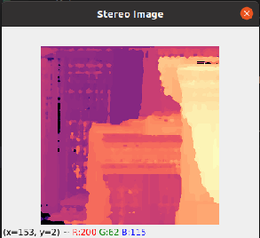

# FUSION

# About 

In this folder , we fuse together monocular and stereo depth maps and obtain a refined depth map having advantages of both . 

|Original RGB Image|Midas Depth Map|
|----------|-----------|
||
|Stereo Depth Map|Fused Depth Map|
||

# Methodology 

We develop an approach in which our architecture learns from the high-confidence areas of the stereo vision map. After obtaining the two depth maps we fuse them using three main ideas :

(i) when stereo is considered reliable, its estimates are preserved.
(ii) when the CNN is better at estimating relative depths, its output should be scaled to the stereo range.
(iii) when in a region of low stereo confidence, if the relative depth estimates are dissimilar, the CNN is trusted more; otherwise, stereo estimates are trusted more.

For this we propose a formula which will be applied to the stereo and monocular depths .


The final depth estimate Z(x,y) resulting from the fusion operation is given by .


where Zm(x, y)and Zs(x, y)are the monocular and stereo depth estimates, respectively, Wc(x,y ) a weight dependent on the confidence of the stereo map at pixel (x, y), Ws(x,y) a weight evaluating the ratio between the normalized estimates from the CNN and from the stereo algorithm at pixel (x, y), MaxZmscale the maximum of the CNN’s depth scale and MaxZsprediction the maximum depth value estimated by the stereo given the current image pair.

## For Calculating Ws 

Ws(x,y) models whether the final depth prediction, in areas where stereo has low confidence, is closer to the estimate given by the CNN or by stereo. It corresponds to the ratio between the normalized estimate from the CNN, and from the stereo algorithm at pixel (x, y) : 


Now , Ws is given as : 


## For Calculating Wc

### Method 1 - Using Canny Edge Detector as Confidence Map


Since the stereo matching operation works well for vertical
edges, the confidence of stereo depth estimates is determined
by applying a Canny filter to the image. The following
binary rule applies to determine the confidence C(x,y) at a given pixel :


|Canny Edge on RGB Image|
|----------|
||

From C(x,y) we find Wc(x,y) as :


where d is the discrete distance in pixels from pixel (x, y ) until the closest edge .
|Original Rgb Image|Canny Overlaid On Rgb|
|----------|---------|
|||

On the left , we have the original rgb image and on the right we have the stereo confidence map overlaid on the rgb image . Edges appear bright and pixels close to the edges appear grey. 

### Method 2 - Using Stereo Confidence Map of Oak-D Pro

Oak - D Pro already provides confidence of its stereo camera . We use the confidenceMap property of the depth node to access the confidence map and use an XLinkOut to obtain it from the pipeline for fusion . 

|Confidence Map from Oak-D Pro|
|----------|
||

Height confidence areas are close to 0 while low confidence areas are close to 255. 

We normalize the confidence map and apply the formula as :


where d is the value of pixel at (x,y) in confidence map obtained from Oak-D Pro.


### Demo
**To run Fusion on Oak-D Pro , follow the given steps :**

1. Generate blob file for any one model by following steps given in [scripts](../scripts) Readme.


1. 
    * In order to run Fusion by Method 1 using Canny Edge detector for confidence of stereo ,move to the fusion folder and run the following script on your terminal window.

    ```
        python3 Fusion_Canny.py
    ```

    * In order to run Fusion by Method 2 using Confidence Map of Oak-D Pro , move to the fusion folder and run the following script on your terminal window.


    
    ```
        python3 Fusion_OakD.py
    ```

**To try Fusion on your laptop given both depth maps , follow the given steps :**


**Note**: Fusion of two depth maps will only work properly if the size of the maps are same and the maps represent exactly the same scene. Also the depth maps should be in grayscale format .

1. Place the depth map from stereo in folder **StereoMap** ,the depth map using a MDE model in folder **MDEMap** and the RGB Image of the scene in RGBMap.

1. 
    In order to run Fusion on your laptop ,move to the Fusion folder and run the following script on your terminal window .

    ```
        python3 Fusion_Laptop.py
    ```


